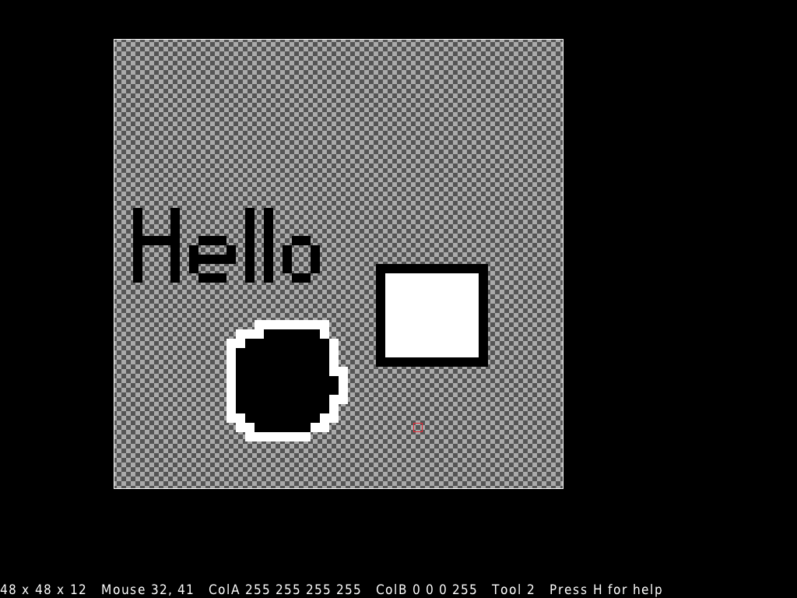

# gxSE
Sprite Editor made with raylib (in early development)

## Building
1. If you're on Windows, download [w64devkit](https://github.com/skeeto/w64devkit/releases). Make sure you get a release zip, not the source code. Extract the archive somewhere and run `w64devkit.exe`. On Linux, just open a terminal.
2. Follow the below instructions for the platform you want to build for.

### Desktop
1. Run `./setup.sh` to set up the project.
2. Run `./build.sh` to compile the project.

### Web
1. Run `TARGET=Web ./setup.sh` to set up the project. You will need about 1 GB of free space.
2. Run `TARGET=Web ./build.sh` to compile the project.

### Compiling for Windows from Linux
1. Install `mingw-w64` using your package manager.
2. Run `TARGET=Windows_NT ./setup.sh` to set up the project.
3. Run `TARGET=Windows_NT ./build.sh` to compile the project.